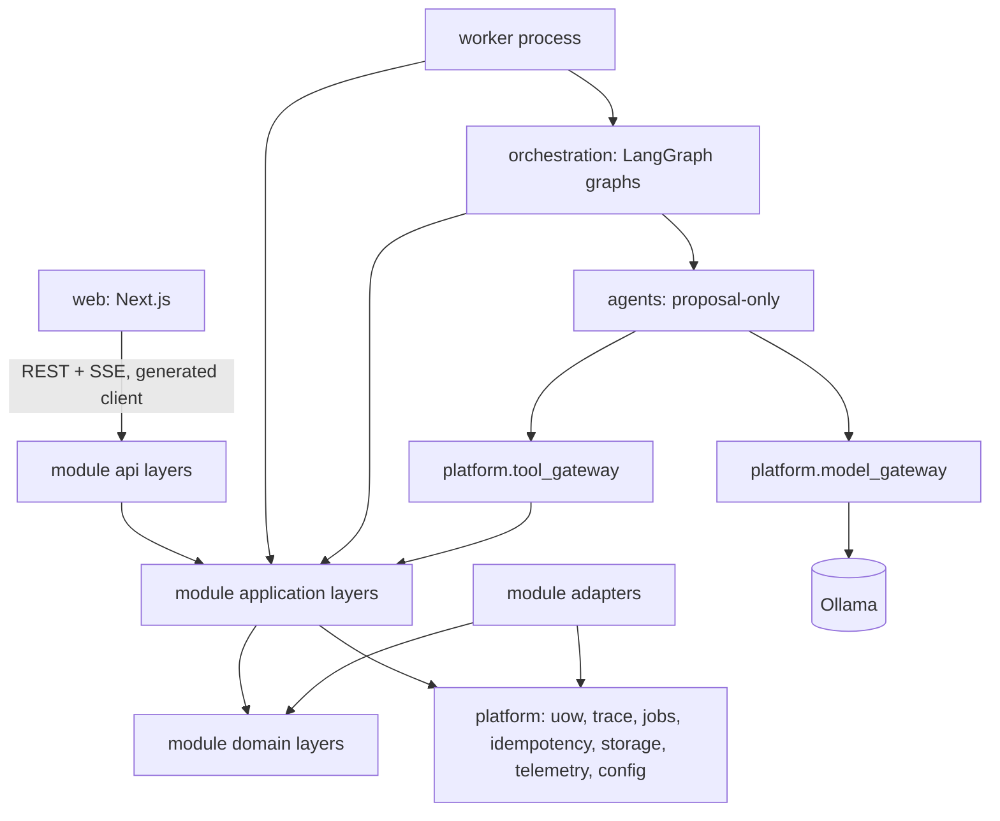
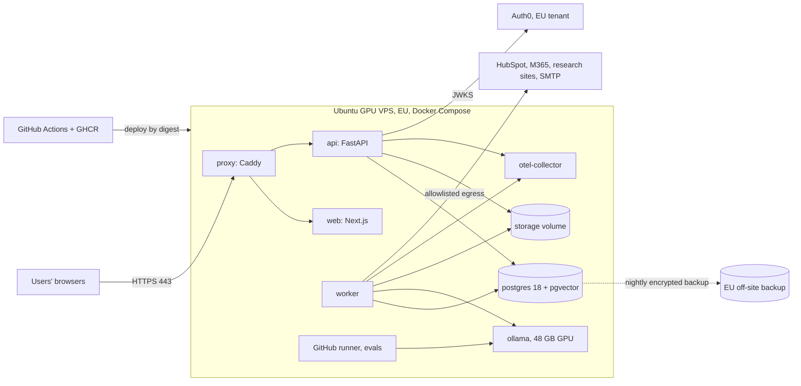
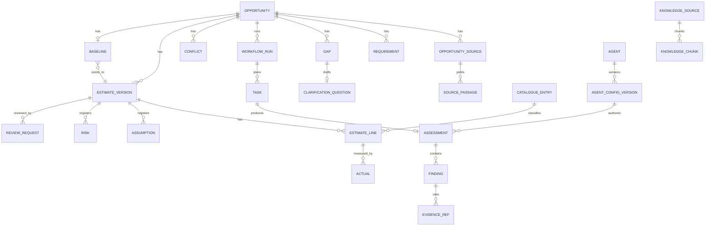

# Architecture Spine: Agentic AI Presales Platform

## Design Paradigm

**Modular monolith, hexagonal per module.** One Python backend codebase runs as two processes (`api`, `worker`), alongside one Next.js web app. Everything is deployed with Docker Compose on a single Ubuntu GPU VPS, with local models served by Ollama. Each business module has four layers:

| Layer | Directory | May depend on |
| --- | --- | --- |
| API (HTTP adapters) | `modules/<m>/api/` | own `application` |
| Application (commands, queries, public interface) | `modules/<m>/application/` | own `domain`, other modules' `application/public.py`, `platform` ports |
| Domain (entities, state machines, rules, ports) | `modules/<m>/domain/` | nothing outside itself |
| Adapters (DB repositories, external systems) | `modules/<m>/adapters/` | own `domain` ports, `platform` |

`orchestration` (LangGraph) and `agents` sit outside the business modules. They drive the modules only through `application/public.py`.



## Invariants & Rules

### AD-1: Modular monolith, two backend processes

- **Binds:** all
- **Prevents:** microservice sprawl, and new datastores or brokers appearing on a single small-company server.
- **Rule:** The backend is one Python package and one image, run as `api` (HTTP only) and `worker` (jobs only). `api` never executes agents, graphs or document parsing. Adding a deployable, datastore or broker requires a new AD.

### AD-2: Every entity has exactly one owning module

- **Binds:** all modules; see the Entity ownership table
- **Prevents:** two modules writing one table, and cross-module joins that couple schemas.
- **Rule:**
  - Each table belongs to one module and carries its prefix (`estimates_*`, `gaps_*`); `platform_*` tables belong to `platform`.
  - Only the owner's adapters read or write a table.
  - Other modules call the owner's `application/public.py` (commands and queries returning Pydantic DTOs).
  - Read-only `reporting_*` views may join across modules and are never written.
  - Ownership is fixed by the Entity ownership table below. A new entity is added to that table before any code is written.

### AD-3: One mutation path: command → authorize → validate → write + trace, inside one Unit of Work

- **Binds:** all state changes; FR-6, FR-35, FR-41, FR-62
- **Prevents:** state changed without authorization or trace, and cross-module calls that commit separately.
- **Rule:**
  - Business state changes only through application-service commands.
  - A command runs inside a `platform.uow` Unit of Work. A command called by another module joins the caller's Unit of Work and never opens or commits its own transaction.
  - Each command: calls `identity.authorize`, checks domain rules and state-machine transitions, checks `row_version`, writes, and calls `platform.trace.append(uow, …)` (AD-12).
  - Jobs and outbound effects are enqueued in the same Unit of Work (AD-29).
  - No other code issues INSERT, UPDATE or DELETE on business tables. The only exception is the purge job (AD-31).

### AD-4: Agents propose; they never write

- **Binds:** FR-5, FR-11, FR-12, FR-20–FR-28, FR-30, FR-32, FR-47; spec §8.2
- **Prevents:** LLM output entering business state unvalidated.
- **Rule:**
  - An agent returns an `AgentResult` (base model in `agents/contract.py`, with `contract_version`). Agent-specific data goes only under `extensions.<agent_id>` with a registered schema.
  - The owning module's `accept_*` command validates the base contract, the extension, the Evidence references (AD-13) and the agent's permissions, then stores the result.
  - Rejected results return to orchestration for bounded retry or escalation (FR-19).

### AD-5: Agents and contracts are independent of the orchestration framework

- **Binds:** `agents/*`, `orchestration/*`; spec §5.3
- **Prevents:** business logic locked into LangGraph, and each agent built in a different style.
- **Rule:**
  - An agent is a plain class implementing `Agent.run(task: TaskInput) -> AgentResult`, registered in the Agent Registry (AD-22).
  - Only `orchestration/` imports `langgraph`. Nodes are thin wrappers: load inputs through queries, call the agent, submit through `accept_*`, and update task status through `workflows` commands.

### AD-6: Graph state is a cache of control data; `workflows` owns run truth

- **Binds:** FR-3, FR-15–FR-19, FR-63
- **Prevents:** divergence between checkpoints and the database, and duplicate writes when a node replays.
- **Rule:**
  - The `workflows` module owns Workflow Run, Plan (versioned), Task and the run's input-version pins. Its commands are the only writers of run and task status.
  - Checkpoint state holds IDs, counters and budgets only, and re-reads `workflows` on every resume.
  - `platform_jobs.status` is infrastructure state and never shown as run status.
  - Every command issued from a node carries an idempotency key (AD-29). Side effects before `interrupt()` must be idempotent, because the node reruns from its start on resume.
  - The checkpointer is `langgraph-checkpoint-postgres` on its own connection pool, with `search_path=orchestration_checkpoints`, `autocommit=True`, `row_factory=dict_row`, and `LANGGRAPH_STRICT_MSGPACK=true`. The LangGraph `thread_id` equals `workflow_run_id`.

### AD-7: Execution model: Postgres job queue, worker-only execution, interrupt/resume

- **Binds:** FR-3, FR-16, FR-17, FR-18, FR-63; NFR-2
- **Prevents:** agents running inside HTTP requests, lost runs, and a second queue technology.
- **Rule:**
  - Work runs only as `platform_jobs` rows claimed by the worker (`FOR UPDATE SKIP LOCKED`) under the job contract in AD-29.
  - Waiting for a human means a LangGraph `interrupt()` plus run status `waiting_for_human`. The human action is a command that enqueues a `workflows.resume` job, which calls `Command(resume=…)`.
  - Cancellation sets the run status to `cancelled` through `workflows`. The worker checks for it between nodes and stops.

### AD-8: ModelGateway is the only path to a model

- **Binds:** all agents, embeddings; FR-18, FR-56, FR-59, FR-60
- **Prevents:** inconsistent context sizes, schemas, retries, budgets and cost tracking across agents.
- **Rule:**
  - Agents call `platform.model_gateway` only. The gateway port is provider-neutral and has two backend adapters:
    - **Ollama adapter (default):** uses the native `/api/chat` and `/api/embed` endpoints, with `format` set to the output JSON Schema.
    - **OpenAI-compatible adapter:** uses `response_format`, for a later move to vLLM.
  - The context size comes only from the model profile (AD-22), never from Ollama's default or a per-call guess.
  - On every call the gateway:
    - takes the model profile from the agent's registry config version;
    - uses low temperature for structured tasks;
    - validates the output with Pydantic and retries within the configured limit;
    - enforces the run's token, call and time budgets;
    - acquires a slot from the priority-aware GPU semaphore (AD-29 priority classes);
    - writes a `platform_model_calls` row (run, task, agent, config version, model digest, tokens, latency, outcome).

### AD-9: ToolGateway is the only path to tools; agents get read-only, task-scoped tools

- **Binds:** FR-23, FR-57, FR-61; PRD §9 Privacy; spec §22
- **Prevents:** agents acting outside their permissions, sending externally, acting on injected instructions, or seeing more data than their task needs.
- **Rule:**
  - Agents reach tools only through `platform.tool_gateway`. It checks the agent's registry permissions (action names per AD-15) on every call and audits denials.
  - Agent tools are READ-only and scoped to the task's Opportunity. The only exception is the R4 past-project Evidence tool (`actuals.find_similar_lines`). It reads closed Opportunities, but returns only lines, Actuals and variance causes, with no Source text or customer content. No agent ever has write, delete, send or approve tools.
  - Research egress uses an allowlist of domains, and every fetched page is stored as a `knowledge_research_snapshots` row.
  - Untrusted text reaches prompts only inside delimited data blocks. A prompt-injection heuristic flag is recorded on any affected Finding.

### AD-10: Deterministic code owns numbers, rules and permissions

- **Binds:** FR-14, FR-24, FR-29, FR-30, FR-33, FR-39, FR-62; spec §14.3
- **Prevents:** an LLM computing totals, deciding policy, or overriding mandatory constraints.
- **Rule:**
  - These are domain code, never model output: Estimate arithmetic, pricing (through the `pricing` port, AD-17), approval policy, mandatory Checklist items, security-policy checks, structured-field Conflict detection, permissions, Evidence validation, and submission blockers (AD-27).
  - LLMs are used only for extraction, drafting, assessment narrative and semantic comparison.
  - Mandatory security and authorization policies have no override path.

### AD-11: Versioned, immutable decision records with optimistic concurrency

- **Binds:** FR-5–FR-7, FR-13, FR-35, FR-38, FR-44–FR-46, FR-19 (concurrent edits)
- **Prevents:** silent overwrites, lost updates, and extraction overwriting human edits.
- **Rule:**
  - An Estimate Version is immutable once submitted. Any change creates a new version through `estimates.create_version`, including Scenario versions (`scenario_id`).
  - Requirements, Assumptions, Checklists and registry configs carry version numbers.
  - Requirements carry `origin: extracted | human` and `locked_by_human`. Extraction and Gap answers never update a human-touched Requirement; they call `intake.propose_requirement_change`, which creates a pending change for a human to confirm.
  - Merges and splits are trace events that record lineage.
  - Every mutable row has `row_version`. The API requires `If-Match` and returns 412 on mismatch.

### AD-12: Append-only trace through one platform writer

- **Binds:** FR-41, FR-42, FR-29, FR-38, FR-56, FR-62; NFR-6
- **Prevents:** a trace that disagrees with state, editable history, unaudited admin actions, and per-module payload shapes.
- **Rule:**
  - `platform_trace_events` columns: `id, opportunity_id (nullable), workflow_run_id?, actor_type (user|agent|system), actor_id, event_type, subject_type, subject_id, subject_version?, payload jsonb, occurred_at`.
  - Rows are written only through `platform.trace.append(uow, event)`. Every `event_type` has one Pydantic payload model in `platform/trace/catalogue.py`.
  - Events with no Opportunity (registry, catalogue, roles, exports, policy changes, sensitive reads) use `opportunity_id = null`.
  - The application DB role has no UPDATE or DELETE on the table. Only the purge job (AD-31) may delete.
  - No model chain-of-thought is stored.

### AD-13: Typed, versioned Evidence references, validated on acceptance

- **Binds:** FR-5, FR-25, FR-42, FR-47, FR-52
- **Prevents:** invented sources, citations that silently change meaning, and inconsistent span offsets.
- **Rule:**
  - Evidence is `{kind, id, version?, span?}`, where `kind ∈ requirement | source_passage | knowledge_chunk | actual | research_snapshot`.
  - `version` is required whenever the target is versioned.
  - `source_passage` rows are owned by `intake`. They are immutable and point at the stored extracted-text artifact of a source version. Spans are always Unicode code-point offsets into that artifact.
  - `accept_*` rejects any reference that doesn't resolve.
  - Every Finding has at least one reference, or is typed as an Unknown or Assumption.

### AD-14: Retrieval lives in Postgres (pgvector); vectors are tagged with their model

- **Binds:** FR-8, FR-11, FR-20–FR-23, FR-52
- **Prevents:** a second search store, and mixed-model vectors.
- **Rule:**
  - `knowledge_chunks` stores text, source version, catalogue tags, `embedding_model`, `embedding_dims`, and an untyped `vector` column.
  - Each active model has a partial HNSW expression index: `((embedding::vector(<dims>))) WHERE embedding_model = '<model>'`.
  - Queries use the same cast and filter.
  - Changing the model means a full background re-embed job.

### AD-15: Identity at the edge, authorization in one policy module with one action vocabulary

- **Binds:** FR-1, FR-37, FR-39, FR-57, FR-58, FR-64; NFR-4
- **Prevents:** scattered permission logic, and mismatched permission names.
- **Rule:**
  - Authentication uses **Auth0** (EU tenant). The web app signs users in with `@auth0/nextjs-auth0` (v4 `Auth0Client`, Next.js 16 `proxy.ts`) and requests access tokens for the API audience.
  - The API validates the Auth0 access token on every request with PyJWT `PyJWKClient`: RS256, JWKS, `iss`, `aud` (the API identifier) and `exp`. It maps `sub` to a platform user.
  - Auth0 provides identity only. Auth0 RBAC is not used, so roles and Opportunity membership live in `identity`. The user's first login provisions a platform user with no roles until an admin assigns them.
  - All decisions go through `identity.authorize(actor, action, resource)`, called inside commands and queries.
  - Action names follow `<module>.<entity>.<verb>`, matching the command name, and live in one catalogue (`identity/actions.py`). The Agent Registry uses the same names.
  - Agents act with `actor_id = "<agent_id>@<semver>"`.
  - The UI is never the enforcement point.

### AD-16: One API contract style, including streaming and downloads

- **Binds:** web ↔ api; FR-2, FR-3, FR-36
- **Prevents:** inconsistent endpoints and error shapes, hand-written client types, and auth holes in streams or downloads.
- **Rule:**
  - REST JSON under `/api/v1`. Errors are RFC 9457 `application/problem+json` with a stable `code`.
  - The web app uses only the client generated from FastAPI's OpenAPI spec.
  - Live updates use one SSE stream per Opportunity at `/api/v1/opportunities/{opportunity_id}/events`, read with fetch-based SSE carrying the bearer token (AD-30).
  - File downloads use short-lived HMAC-signed URLs issued by an authorized API call.
  - There are no WebSockets.

### AD-17: External systems behind ports, with idempotent outbound writes

- **Binds:** FR-24, FR-40, FR-53–FR-55
- **Prevents:** vendor types in domain code, duplicate CRM writes, and unaudited sync.
- **Rule:**
  - Each integration (HubSpot, Microsoft 365, Confluence, pricing rules, email/Teams notifications) is an adapter in `integrations/` implementing a port.
  - Inbound data enters only through module commands.
  - Outbound writes run as jobs, carry an `out:` idempotency key (AD-29), and append a trace event.
  - HubSpot uses the date-versioned CRM API (latest at build time; `2026-09` today) over `httpx`.

### AD-18: Files through a storage port; immutable, validated and parsed in a sandbox

- **Binds:** FR-4, FR-8, FR-36, FR-47
- **Prevents:** hard-coded paths, edited originals, and hostile files reaching parsers unchecked.
- **Rule:**
  - Files go through `platform.storage`, which in R1 is a local volume. They are stored by SHA-256, never modified, and reference-counted for purge (AD-31).
  - Uploads are size-limited at Caddy and the API, checked against an extension allowlist plus magic bytes, and parsed only in worker jobs in a subprocess with CPU, memory and time limits.
  - Per-user rate limits apply at the API.
  - Extracted text is stored as its own immutable artifact, which AD-13 offsets point into.

### AD-19: One VPS, Docker Compose, private by default

- **Binds:** NFR-2, NFR-3, NFR-4, NFR-6
- **Prevents:** exposed internal services, drift between environments, and unrecoverable loss.
- **Rule:**
  - One `compose.yaml` defines `proxy, web, api, worker, postgres, ollama, otel-collector` and a one-shot `migrate`.
  - Only `proxy` publishes ports (80/443, automatic TLS).
  - Every service has a healthcheck and `restart: unless-stopped`. `ollama` gets the GPU through the NVIDIA Container Toolkit.
  - `migrate` runs Alembic before `api` and `worker` start, using expand/contract migrations only.
  - Environments are `local` (same compose file) and `prod`. Staging is optional `[ASSUMPTION]`.
  - The VPS and the backup location are in the EU `[ASSUMPTION]`.

### AD-20: Observability without customer content in logs

- **Binds:** FR-59; NFR-5; PRD §9
- **Prevents:** untraceable runs, customer data in logs, and silent failures on an unattended server.
- **Rule:**
  - OpenTelemetry uses `workflow_run_id` as the correlation ID, propagated from api through jobs and graph to gateway calls, and exported to the local `otel-collector`, which writes to files with 30-day retention.
  - Logs are structured JSON containing IDs only.
  - Cost and tokens come from `platform_model_calls`.
  - Email alerts fire on: failed healthcheck, disk above 80%, GPU out of memory, failed backup, certificate expiring within 14 days, and dead jobs.
  - Nothing is sent to a SaaS tracer.

### AD-21: Prompts, schemas and evals are code; CI gates them

- **Binds:** FR-25, FR-56, FR-60
- **Prevents:** untracked prompt edits, and model, prompt or digest changes shipping without a quality check.
- **Rule:**
  - Prompts live at `agents/<agent_id>/prompts/v<N>.md`. Pydantic models are the source of truth for agent I/O, and JSON Schemas are generated from them.
  - The reference set is in `evals/`. `make eval` runs it through the ModelGateway.
  - CI blocks merges that change prompts, agents, model profiles or model digests and fail the FR-60 thresholds.

### AD-22: Agent Registry is DB-owned; model profiles are pinned and sized to one GPU

- **Binds:** FR-56, FR-63, NFR-1, NFR-3
- **Prevents:** hard-coded models, silent model changes, configs that don't fit in VRAM, and runs that can't be reproduced.
- **Rule:**
  - `registry` owns agents and immutable `registry_agent_config_versions` (model profile, prompt version, schema version, permissions, budgets).
  - A config may reference only prompt and schema versions present in the deployed image. Runs pin a config version (FR-63).
  - A model profile is a repo Modelfile (`ops/models/<profile>.Modelfile`, which sets `num_ctx` and parameters), built at deploy into a named Ollama model and pinned by digest.
  - Target host: one GPU with 48 GB VRAM, 64 GB RAM and 16 cores `[RAM/CPU ASSUMPTION]`.
  - Defaults: chat `gpt-oss:20b` (Apache-2.0, 128K max context) and embeddings `bge-m3` (MIT, 1024 dims). Both stay loaded in VRAM at the same time.
  - The sum of model weights plus KV cache (`num_ctx` × `OLLAMA_NUM_PARALLEL`) must fit in VRAM. Gateway slots never exceed `OLLAMA_NUM_PARALLEL`.
  - Any new model needs a licence check and an eval pass.

### AD-23: `gaps` owns Gaps and Unknowns; `estimates` owns Assumptions and Risks

- **Binds:** FR-11–FR-14, FR-25, FR-34, FR-49
- **Prevents:** three Assumption shapes, an unowned Risk, and an FR-14 check that can't be built.
- **Rule:**
  - Unknowns raised in Assessments are registered through `gaps.register_unknown`. Gaps and Unknowns share one lifecycle: `open → answered | converted | dismissed_with_reason`.
  - Assumptions (`kind: condition | contingency`, `accepted_by`, `accepted_at`) and Risks belong to one Estimate Version, and each has one `origin_ref` (Gap, Unknown or Finding).
  - Converting a Gap or Unknown is one command, `estimates.convert_to_assumption` or `convert_to_risk`, which calls `gaps.mark_converted` in the same Unit of Work.
  - A new Estimate Version carries Assumptions and Risks forward explicitly.

### AD-24: `workflows` module owns run lifecycle; one start path

- **Binds:** FR-3, FR-7, FR-15, FR-16, FR-38, FR-44, FR-63
- **Prevents:** run status stored in four places, reruns blocked by duplicate-start checks, and Challenges creating versions outside a run.
- **Rule:**
  - Every Workflow Run starts through `workflows.start_run(opportunity_id, run_type, trigger_ref, idempotency_key)`. `run_type` ∈ `assessment, reassessment, challenge, scenario, negotiation`.
  - Duplicate detection uses the idempotency key, never the Opportunity alone.
  - Plans are versioned rows. Input pins record source, requirement and registry config versions.
  - Task progress is written to `workflows_progress`, a non-audit table that is pruned after 30 days.

### AD-25: Shared Unit of Work and transaction boundaries

- **Binds:** all cross-module commands
- **Prevents:** partial commits across modules, and undefined "same transaction" semantics.
- **Rule:**
  - `platform.uow` opens one DB transaction per inbound request or job step.
  - `public.py` commands take the Unit of Work as their first argument.
  - Commits happen only at the edge: the API request handler or the job runner.
  - External I/O (LLM calls, HTTP calls) never happens inside an open Unit of Work.

### AD-26: Baseline lives in `estimates`; Baseline changes are serialised per Opportunity

- **Binds:** FR-39, FR-46, FR-48, FR-62
- **Prevents:** two writers of the Baseline pointer, Scenario promotion that skips the checks, and races with review decisions.
- **Rule:**
  - The Baseline is `estimates_baselines (opportunity_id, estimate_version_id, set_at, set_by)` and is written only by `estimates.set_baseline`.
  - `set_baseline` evaluates the FR-62 and FR-39 checks under a per-Opportunity lock (`pg_advisory_xact_lock(opportunity_id)`). Every command that affects those checks (review decisions, Finding overrides, Gap conversion) takes the same lock.
  - Scenario promotion calls `set_baseline`.
  - Opportunity lifecycle status is derived by a query, never stored.

### AD-27: One owner per blocker; one submission check

- **Binds:** FR-14, FR-27–FR-31, FR-62
- **Prevents:** Critic contradictions duplicated as Conflicts, stale Finding references, and divergent blocking logic.
- **Rule:**
  - Contradictions found by Critic or Red Team become Conflicts in `conflicts`.
  - Findings are referenced together with their Assessment version.
  - `assessments` owns FindingOverride.
  - `estimates.get_submission_blockers(version)` is the only check used before submit or Baseline. It queries open Gaps and Unknowns, unaccepted Assumptions, open Conflicts, unoverridden critical Findings and pending Review Requests.

### AD-28: `reviews` owns Review Requests, decisions and Challenges

- **Binds:** FR-37–FR-40, FR-62
- **Prevents:** split review ownership, untyped targets, and approvals that survive a new version.
- **Rule:**
  - Targets are typed and versioned: `{kind: estimate_version | assessment | proposal, id, version}`. `proposal` was added for R2.
  - Review decisions are `approved, rejected, challenged, evidence_requested, alternative_requested, escalated`.
  - A Challenge starts a run through `workflows.start_run(run_type=challenge)`. Only that run creates the new Estimate Version.
  - A new Estimate Version marks open requests on the old version `superseded`.
  - Reminders and escalations are scheduled jobs (AD-29) sent through `notifications`.

### AD-29: Job contract and idempotency

- **Binds:** FR-16, FR-18, FR-19, FR-40, FR-53, FR-55; NFR-2
- **Prevents:** stuck or duplicated jobs, retries that can never succeed, and GPU starvation.
- **Rule:**
  - Every job type is registered in `platform/jobs/registry.py` with a typed payload, a priority class (`interactive > background`), timeout, retry policy and backoff.
  - Jobs are enqueued inside the caller's Unit of Work. A worker holds a lease with a heartbeat, and expired leases are reclaimed. Jobs that exhaust their retries become `dead` and raise an alert.
  - Recurring work comes from `platform_schedules`.
  - Idempotency keys live in `platform_idempotency` (unique key, result reference). The key grammar is:
    - `run:<opportunity_id>:<client_key>` for starts;
    - `node:<workflow_run_id>:<task_id>:<attempt>` for node commands, where a retry increments `attempt` after a rejection;
    - `out:<integration>:<subject_id>:<subject_version>` for outbound writes.

### AD-30: Event stream contract

- **Binds:** FR-2, FR-3; AD-16
- **Prevents:** oversized NOTIFY payloads, unauthorized stream reads, and lost events on reconnect.
- **Rule:**
  - `NOTIFY` carries only `{event_id, opportunity_id, source}`. The API re-reads each event and authorizes it per subscriber.
  - Frames are `id: <event_id>`, `event: <event_type>`, `data: {event_type, subject_type, subject_id, subject_version, occurred_at, summary}`.
  - Reconnect replays from `Last-Event-ID`.
  - Sources are `platform_trace_events` and `workflows_progress`.

### AD-31: Retention and purge

- **Binds:** NFR-6; PRD §10
- **Prevents:** a conflict between append-only audit and deletion duties, and orphaned files.
- **Rule:**
  - Only the scheduled purge job, running under a separate privileged DB role, deletes data. It enforces the PRD §10 retention periods per Opportunity, including that Opportunity's trace rows, and records a `platform.purge.completed` audit event with no customer content.
  - A file is deleted only when its reference count reaches zero.
  - Purged data is also removed from backups as old backups age out (35-day backup retention `[ASSUMPTION]`).

### AD-32: Operations: build, deploy, secrets, backups, upgrades

- **Binds:** NFR-2, NFR-4; AD-19
- **Prevents:** unrepeatable deploys, leaked secrets, untested restores, and silent model or OS drift.
- **Rule:**
  - **Build and deploy:**
    - GitHub Actions builds images and pushes them to GHCR with immutable tags.
    - `ops/deploy` deploys by image digest and takes a `pg_dump` first. Rollback means redeploying the previous digest.
    - Evals run on a self-hosted GitHub runner on the VPS at `background` GPU priority.
  - **Secrets:**
    - Stored as a `sops`/`age`-encrypted file in the repo and decrypted at deploy into a root-only env file.
    - This replaces the PRD's managed vault (NFR-4) for a single-server deployment.
  - **Backups:**
    - Nightly encrypted `pg_dump`, plus the storage volume, the sops key escrow copy and the Caddy data, sent off the server.
    - RPO 24 h, RTO 4 h `[ASSUMPTION]`.
    - Restore runbook at `ops/runbooks/restore.md`, tested quarterly.
  - **Disk encryption:** full-disk encryption if the provider supports it; otherwise encrypted volumes for `postgres` and storage.
  - **Upgrades:**
    - `unattended-upgrades` applies security patches.
    - A monthly patch window covers images, NVIDIA driver and toolkit, Ollama and Postgres minor versions.
    - Postgres major upgrades follow a runbook.

## Entity Ownership

| Entity | Owner module |
| --- | --- |
| Opportunity, collaborators | `opportunities` |
| Opportunity Source, extracted-text artifact, Source Passage, Requirement, pending Requirement change | `intake` |
| Knowledge Source, Knowledge Chunk, Checklist, Integration Type / Work Package catalogue, Research Snapshot | `knowledge` |
| Gap, Unknown, Clarification Question | `gaps` |
| Workflow Run, Plan, Task, progress, change set | `workflows` |
| Assessment, Finding, FindingOverride | `assessments` |
| Conflict, Negotiation | `conflicts` |
| Estimate, Estimate Version, Estimate Line, Assumption, Risk, Baseline | `estimates` |
| Review Request, Review Decision, Challenge, approval policy | `reviews` |
| Scenario (metadata, constraint deltas) | `scenarios` |
| Proposal | `proposals` |
| Actual, Calibration suggestion | `actuals` |
| Agent, agent config version, eval result | `registry` |
| User, role, action catalogue | `identity` |
| Notification, delivery | `notifications` |
| Integration connection, sync state, pricing rule set | `integrations` |
| Trace event, job, schedule, idempotency key, model call, file metadata | `platform` |

## Consistency Conventions

| Concern | Convention |
| --- | --- |
| IDs | UUIDv7 (`uuid`), serialised as strings. No sequential IDs exposed. |
| Time | `timestamptz` in UTC; ISO-8601 with `Z` in the API. |
| Money / effort | Money as integer minor units plus ISO-4217 currency. Effort in person-hours, `numeric(10,1)`. |
| Naming | Tables are `<module>_<plural_snake>`. Enum values, Python modules and JSON fields are `snake_case`. TS types are generated only. |
| Events and actions | Trace events are `<module>.<entity>.<past_tense_verb>`. Actions are `<module>.<entity>.<verb>`. Job types are `<module>.<verb>`. |
| Glossary | Code, schemas and UI use PRD §3 terms exactly. |
| Statuses (domain state machines) | **Workflow Run:** `queued, running, waiting_for_human, completed, failed, cancelled`. **Task:** `queued, running, completed, failed, timed_out, skipped`. **Gap/Unknown:** `open, answered, converted, dismissed_with_reason`. **Clarification Question:** `drafted, approved, sent, answered, unanswered`. **Conflict:** `open, negotiating, resolved, escalated`. **Finding:** `open, resolved, overridden`. **Estimate Version:** `draft, submitted, in_review, approved, rejected, superseded`. **Review Request:** `pending, approved, rejected, challenged, superseded, cancelled`. **Challenge:** `awaiting_confirmation, reassessing, completed, declined, failed`. **Proposal:** `draft, in_review, approved, released, superseded`. **Job:** `queued, leased, succeeded, failed, dead`. |
| Errors | problem+json `{type, title, status, code, detail, instance}`. Domain errors are typed exceptions mapped in one place. |
| Config | `pydantic-settings`, env vars prefixed `PSA_`, read only in `platform.config`. |
| Agent IDs | `snake_case` ending in `_agent`, with semver versions. |
| Catalogue | Checklists, Assessment lines, Estimate lines and Actuals reference catalogue IDs (FR-65). |
| Testing | `pytest`. Domain is tested without DB or LLM. Agents use a fake ModelGateway. Graphs and commands get Postgres integration tests. The web app runs axe accessibility checks in CI (NFR-7). |

## Stack

| Name | Version |
| --- | --- |
| Python | 3.13 `[ASSUMPTION: confirm full install]` |
| FastAPI | 0.142.2 |
| Pydantic | 2.13.5 |
| SQLAlchemy | 2.1.1 |
| Alembic | 1.20.0 |
| psycopg | 3.3.6 |
| LangGraph | 1.2.12 |
| langgraph-checkpoint-postgres | 3.1.2 |
| PostgreSQL | 18.6 |
| pgvector extension / image | 0.8.6 / `pgvector/pgvector:0.8.6-pg18-trixie` |
| pgvector (Python client) | 0.5.0 |
| Ollama | 0.35.0 |
| Default chat model | gpt-oss:20b (pinned by digest at deploy) |
| Default embedding model | bge-m3 (pinned by digest at deploy) |
| docling | 2.131.0 |
| pymupdf | 1.28.2 |
| extract-msg | 0.56.1 |
| opentelemetry-sdk | 1.45.0 |
| Node.js | 24 LTS |
| Next.js | 16.3.8 |
| React | 19.3.0 |
| Tailwind CSS | 4.3.3 |
| shadcn/ui CLI | 4.21.0 |
| @auth0/nextjs-auth0 | 4.31.0 |
| PyJWT | 2.15.1 |
| HubSpot CRM API | 2026-09 |
| Caddy | 2.11.4 |
| NVIDIA Container Toolkit | 1.20.1 |
| Host OS | Ubuntu 24.04 LTS |

## Structural Seed

**Deployment (single VPS)**



**Core entities (names and relationships only)**



**Source tree**

```text
pre-sales-agent/
  compose.yaml
  backend/
    app/
      modules/                # each: api/ application/ domain/ adapters/
        opportunities/ intake/ knowledge/ gaps/ workflows/ assessments/ conflicts/
        estimates/ reviews/ scenarios/ proposals/ actuals/ registry/ identity/
        notifications/ integrations/
      orchestration/          # LangGraph graphs and node wrappers (only langgraph importer)
      agents/                 # contract.py; <agent_id>/agent.py, schemas.py, prompts/vN.md
      platform/               # uow, trace (catalogue), jobs (registry), idempotency, model_gateway,
                              # tool_gateway, storage, telemetry, config
      main_api.py  main_worker.py
    migrations/
    tests/
  evals/
  web/                        # Next.js App Router; src/lib/api = generated client
  ops/                        # Caddyfile, models/*.Modelfile, deploy, backup, runbooks/
```

## Capability → Architecture Map

| Capability / Area (PRD) | Lives in | Governed by |
| --- | --- | --- |
| 4.1 Workspace, FR-64 | `opportunities`, `web` | AD-2, AD-15, AD-16, AD-26 (derived status), AD-30 |
| 4.2 Intake | `intake`, `intake_agent` | AD-4, AD-11, AD-13, AD-18 |
| 4.3 Knowledge Base, FR-65 | `knowledge` | AD-14, AD-18 |
| 4.4 Gaps and Clarification | `gaps`, `clarification_agent` | AD-10, AD-23 |
| 4.5 Orchestration, FR-63 | `workflows`, `orchestration`, `platform.jobs` | AD-6, AD-7, AD-24, AD-25, AD-29 |
| 4.6 Specialist Assessment | `assessments`, `agents/*` | AD-4, AD-5, AD-8, AD-9, AD-13, AD-22 |
| 4.7 Critic / Red Team | `assessments`, `conflicts` | AD-10, AD-27 |
| 4.8 Conflicts, Negotiation (R3) | `conflicts`, `orchestration` | AD-8, AD-10, AD-27 |
| 4.9 Estimate and Assumptions | `estimates` | AD-10, AD-11, AD-23, AD-27 |
| 4.10 Reviews, Challenge, FR-62 | `reviews`, `estimates` | AD-26, AD-28 |
| 4.11 Decision Trace | `platform.trace`, read queries in each module | AD-12 |
| 4.12 Replanning, Scenarios (R3) | `scenarios`, `workflows`, `estimates` | AD-11, AD-24, AD-26 |
| 4.13 Proposals (R2) | `proposals` | AD-4, AD-13, AD-18 |
| 4.14 Actuals, Calibration (R4) | `actuals`, `reporting_*` | AD-2, AD-10 |
| 4.15 Integrations (R2), notifications | `integrations`, `notifications` | AD-17, AD-29 |
| 4.16 Registry, observability, evals | `registry`, `platform.telemetry`, `evals/` | AD-20, AD-21, AD-22 |
| 4.17 Untrusted content | `platform.tool_gateway`, `platform.storage` | AD-9, AD-18 |
| NFRs, retention, operations | `platform`, `ops` | AD-19, AD-20, AD-31, AD-32 |

## PRD Deviations (binding user decisions; request PRD update)

| PRD statement | Spine | Reason |
| --- | --- | --- |
| §9 and §11: OpenAI/Anthropic model providers | Local Ollama models (AD-8, AD-22) | User decision: data stays on own server |
| NFR-3: 50 concurrent runs, horizontal API scaling | Runs queue on one GPU; single VPS | User decision: one VPS. Revise after load test |
| NFR-4: managed vault | sops/age encrypted secrets (AD-32) | Single-server deployment |
| Addendum: LangSmith, WebSockets | OTel to a local collector; SSE only | Data locality; one streaming mechanism |
| §11 and FR-58: company SSO (Entra ID assumed) | Auth0 for authentication; roles in the platform | User decision |

## Deferred

- **Temporal.** The Postgres job queue plus the LangGraph checkpointer covers one server. Revisit if workflows span servers.
- **vLLM serving.** The OpenAI-compatible adapter exists (AD-8). Revisit when the load test shows Ollama saturating.
- **High availability or a second server.** Revisit if downtime near proposal deadlines becomes a business issue.
- **Self-hosted trace UI (Langfuse).** Optional.
- **Staging environment.** Revisit when more than one developer deploys.
- **ClamAV scanning.** Optional on top of AD-18.
- **R3 Negotiation subgraph internals, R4 Calibration algorithm, R2 Proposal templating, M365 Graph details.** Each is decided at its epic, within these ADs.
- **UI design system, accessibility patterns, browser support.** Owned by UX (NFR-7, NFR-8). shadcn/ui is the seed.
- **Multi-tenancy.** Single company.

## Notes from Story Drafting

- The Inbox polls for updates across Opportunities. The SSE stream stays per Opportunity (AD-30), and a per-user stream is deferred.

## Open Questions

1. **PRD NFR-1 and NFR-3.** Revise the latency and concurrency targets after a load test on the 48 GB GPU.
2. **`qwen3.8` licence.** Check before adopting it as the stronger model.
3. **R1 spike.** Is `gpt-oss:20b` structured output, via Ollama `format`, reliable for every agent schema? If not, switch the default model profile.
